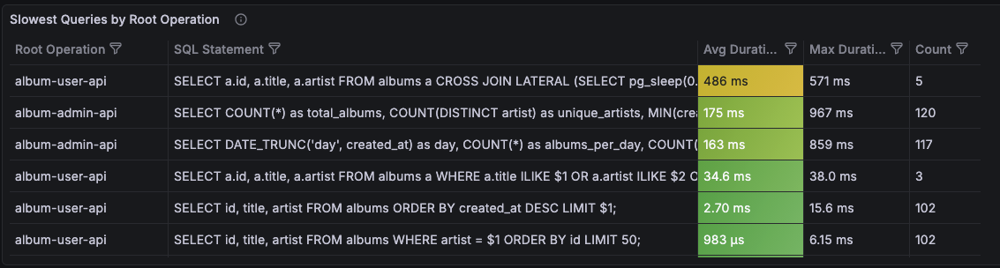
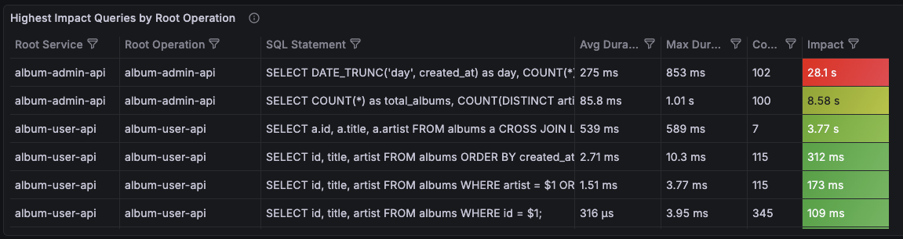
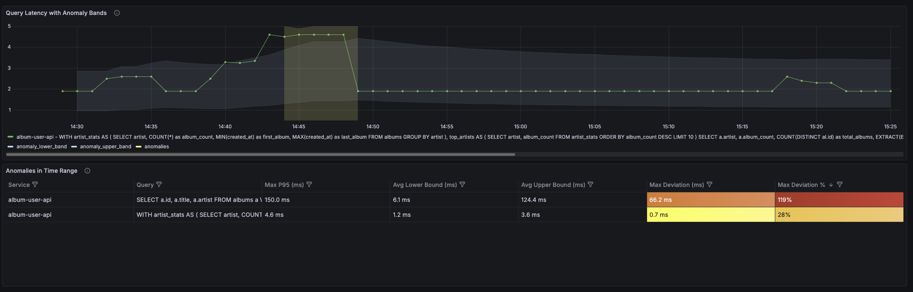

# Slow SQL Detection with OpenTelemetry

A sample application demonstrating how to detect and monitor slow SQL queries using OpenTelemetry.

This sample accompanies the blog post: [How to Turn Slow Queries into Actionable Reliability Metrics with OpenTelemetry](https://www.causely.ai/blog/how-to-turn-slow-queries-into-actionable-reliability-metrics-with-opentelemetry)

## Overview

This project demonstrates a practical implementation of slow SQL detection by:

1. **Emitting database spans** with [OpenTelemetry semantic conventions](https://opentelemetry.io/docs/specs/semconv/db/database-spans/) from Go services
2. **Distilling metrics** from spans using the OpenTelemetry Collector's [`spanmetricsconnector`](https://github.com/open-telemetry/opentelemetry-collector-contrib/tree/main/connector/spanmetricsconnector)
3. **Detecting anomalies** using [PromQL-based adaptive thresholds](https://github.com/grafana/promql-anomaly-detection)
4. **Visualizing** results in [Grafana dashboards](https://grafana.com/oss/grafana/), with [docker-otel-lgtm](https://github.com/grafana/docker-otel-lgtm)

## Prerequisites

- [Docker](https://www.docker.com/)

## Quick Start

Bring up all the services with `docker-compose`, wait for the load generator to create some traffic, and then go to `http://localhost:3001` to take a look at the dashboards.

```bash
# Start all services
docker-compose up -d

# Check service status
docker-compose ps

# Stop all services
docker-compose down
```

## Services

The sample app comes with a a load generator, so there is no need for you to create requests, the access to the ports are
there just for developing the app. You should be most interested in going to the Grafana UI at `http://localhost:3001`

| Service | Port | Description |
|---------|------|-------------|
| `album-user-api` | 8080 | User-facing API with album queries |
| `album-admin-api` | 8081 | Admin API with statistics and analytics |
| `postgres` | 5432 | PostgreSQL database |
| `otelcol` | 4317/4318 | OpenTelemetry Collector (gRPC/HTTP) |
| `lgtm` | 3001 | Grafana with Loki, Tempo, and Mimir |
| `traffic` | - | Traffic generator for demo purposes |


## Viewing Dashboards

1. Open Grafana at http://localhost:3001
2. Login with `admin` / `admin`
3. Navigate to **Dashboards** → **Slow SQL Dashboards**

Three dashboards are included:

- [**v1**](./slowsql-dashboard-v1.json): Basic slow query metrics
  
- [**v2**](./slowsql-dashboard-v1.json): Query impact analysis (latency × call rate)
  
- [**v3**](./slowsql-dashboard-v1.json): Anomaly detection with adaptive thresholds
  

## Anomaly Detection

The sample includes rules for the [PromQL Anomaly Detection Framework](https://github.com/grafana/promql-anomaly-detection) that:

- Calculate adaptive upper/lower bounds based on historical patterns
- Detect queries that deviate significantly from their baseline
- Support both "adaptive" (short-term) and "robust" (long-term) strategies

Rules are located in [`prometheus-rules/`](./prometheus-rules) and automatically loaded by the LGTM stack.

## License

This project is licensed under the Apache License 2.0 - see the [LICENSE](LICENSE) file for details.
